# RateHub — Store Rating Platform

A full-stack web application where users can rate registered stores from 1 to 5. One login serves three roles: **System Administrator**, **Normal User**, and **Store Owner**.

> Built for the FullStack Intern Coding Challenge.

## Overview

RateHub is a full-stack store rating platform built with React, Node.js, Express.js, and MySQL. The application provides role-based access for administrators, normal users, and store owners, with JWT authentication and secure password hashing.

The platform allows administrators to manage users and stores, normal users to rate stores from 1 to 5, and store owners to view ratings and average store performance.

## Tech Stack

| Layer          | Technology                                               |
| -------------- | -------------------------------------------------------- |
| Frontend       | React (Vite), React Router, Axios, SweetAlert2           |
| Backend        | Node.js, Express.js                                      |
| Database       | MySQL / MariaDB                                          |
| Authentication | JWT + bcryptjs password hashing                          |
| Validation     | express-validator (backend) + matching checks (frontend) |

## Features

### Everyone

* Landing page with Login / Sign Up
* Single login for all roles with role-based redirect
* Update password after login
* Logout
* Dark / light theme

### System Administrator

* Dashboard with total users, stores, and ratings
* Add users with Normal User, Store Owner, or Administrator roles
* Add stores and assign them to store owners
* Users list with Name, Email, Address, and Role
* Stores list with Name, Email, Address, and Rating
* Filters on Name, Email, Address, and Role
* Sorting on every table
* User details
* Store owner details include their store rating

### Normal User

* Sign up and log in
* View all registered stores
* Search stores by name and address
* View overall store rating
* View personal rating
* Submit a rating from 1 to 5
* Modify an existing rating

### Store Owner

* View assigned store
* View store average rating
* View total ratings
* View users who rated the store
* Sort the ratings list

## Validation Rules

| Field    | Rule                                                             |
| -------- | ---------------------------------------------------------------- |
| Name     | 20 to 60 characters                                              |
| Address  | Maximum 400 characters                                           |
| Password | 8 to 16 characters, at least 1 uppercase and 1 special character |
| Email    | Standard email format                                            |
| Rating   | Whole number from 1 to 5                                         |

## Project Structure

```text
fullstack-store-rating/
├── backend/
│   ├── src/
│   │   ├── config/
│   │   │   └── db.js
│   │   ├── controllers/
│   │   │   ├── authController.js
│   │   │   ├── adminController.js
│   │   │   ├── storeController.js
│   │   │   └── ownerController.js
│   │   ├── middleware/
│   │   │   └── auth.js
│   │   ├── routes/
│   │   │   ├── authRoutes.js
│   │   │   ├── adminRoutes.js
│   │   │   ├── storeRoutes.js
│   │   │   └── ownerRoutes.js
│   │   ├── utils/
│   │   │   └── validators.js
│   │   └── server.js
│   ├── schema.sql
│   ├── seed.js
│   ├── .env.example
│   ├── package.json
│   └── package-lock.json
│
├── frontend/
│   ├── public/
│   │   ├── favicon.png
│   │   ├── logo-full.png
│   │   └── logo-icon.png
│   └── src/
│       ├── api/
│       ├── components/
│       ├── pages/
│       ├── utils/
│       ├── App.jsx
│       ├── index.css
│       └── main.jsx
│
├── screenshots/
├── README.md
└── .gitignore
```

## Application Flow

```text
React Frontend
      │
      │ Axios + JWT
      ▼
Express REST API
      │
      │ Role-based authorization
      ▼
MySQL / MariaDB
```

### User Roles

```text
ADMIN
 ├── Dashboard
 ├── Manage Users
 └── Manage Stores

USER
 └── View Stores
      └── Submit / Modify Rating

OWNER
 └── View Own Store
      └── View Ratings & Average
```

## Setup

### Prerequisites

* Node.js 18+
* MySQL or MariaDB
* XAMPP can also be used for MySQL
* Git

### 1. Clone the Repository

```bash
git clone https://github.com/anjalijaisinghani/ratehub.git
cd ratehub
```

### 2. Database Setup

Start MySQL, then import the schema from the `backend` folder:

```bash
mysql -u root -p < backend/schema.sql
```

Alternatively, open `backend/schema.sql` in MySQL Workbench and execute it.

### 3. Backend Setup

```bash
cd backend
npm install
```

Copy `.env.example` to `.env` and configure your database credentials and JWT secret.

Then create the default administrator:

```bash
npm run seed
```

Start the backend:

```bash
npm run dev
```

The API runs at:

```text
http://localhost:5000
```

### 4. Frontend Setup

Open a second terminal:

```bash
cd frontend
npm install
npm run dev
```

Open the application at:

```text
http://localhost:5173
```

## Default Admin Login

| Email               | Password    |
| ------------------- | ----------- |
| `admin@example.com` | `Admin@123` |

Store owners and additional users are created by the administrator through **Add User**.

Normal users can create their own accounts through **Sign Up**.

## API Documentation

All protected routes require the following HTTP header:

```text
Authorization: Bearer <token>
```

### Authentication

| Method | URL                         | Access             | Body                           |
| ------ | --------------------------- | ------------------ | ------------------------------ |
| POST   | `/api/auth/signup`          | Public             | name, email, address, password |
| POST   | `/api/auth/login`           | Public             | email, password                |
| PUT    | `/api/auth/change-password` | Any logged-in user | currentPassword, newPassword   |

### Administrator

All routes below require the `ADMIN` role.

| Method | URL                    | Purpose                              |
| ------ | ---------------------- | ------------------------------------ |
| GET    | `/api/admin/dashboard` | Get total users, stores, and ratings |
| POST   | `/api/admin/users`     | Add a user                           |
| POST   | `/api/admin/stores`    | Add a store                          |
| GET    | `/api/admin/users`     | List and filter users                |
| GET    | `/api/admin/users/:id` | Get user details                     |
| GET    | `/api/admin/stores`    | List and filter stores               |

User list query parameters:

```text
name, email, address, role, sortBy, order
```

Store list query parameters:

```text
name, email, address, sortBy, order
```

### Normal User

All routes below require the `USER` role.

| Method | URL                           | Purpose                                       |
| ------ | ----------------------------- | --------------------------------------------- |
| GET    | `/api/stores`                 | View stores with overall and personal ratings |
| POST   | `/api/stores/:storeId/rating` | Submit or modify a rating                     |

Store list query parameters:

```text
name, address, sortBy, order
```

Rating request body:

```json
{
  "rating": 1
}
```

The rating must be a whole number from 1 to 5.

### Store Owner

All routes below require the `OWNER` role.

| Method | URL                    | Purpose                                          |
| ------ | ---------------------- | ------------------------------------------------ |
| GET    | `/api/owner/dashboard` | View store average rating and users who rated it |

Query parameters:

```text
sortBy, order
```

## Database Design

### Users

Stores user authentication and role information.

```text
users
├── id
├── name
├── email (UNIQUE)
├── password_hash
├── address
└── role (ADMIN / USER / OWNER)
```

### Stores

Stores registered store information.

```text
stores
├── id
├── name
├── email
├── address
└── owner_id → users.id
```

### Ratings

Stores user ratings for stores.

```text
ratings
├── id
├── user_id → users.id
├── store_id → stores.id
└── rating (1–5)
```

Each user can have only one rating per store through:

```text
UNIQUE(user_id, store_id)
```

Average ratings are calculated using `AVG()` when requested, so they remain up to date when ratings are changed.

## Security

* Passwords are hashed using bcrypt
* Plain-text passwords are never stored or returned
* JWT authentication is used for protected routes
* Role-based authorization protects ADMIN, USER, and OWNER endpoints
* SQL queries use parameterized values
* Sort columns are whitelisted
* Owners can only access their own store's data
* Input validation is enforced on both frontend and backend
* Protected routes reject missing or invalid authentication tokens

## Screenshots

### Landing Page

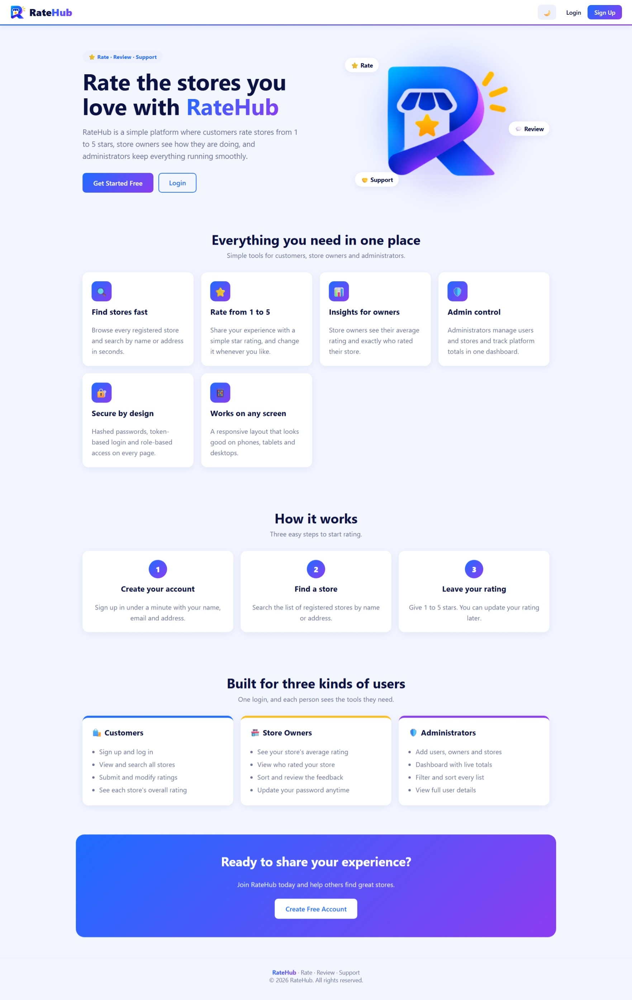

### Login

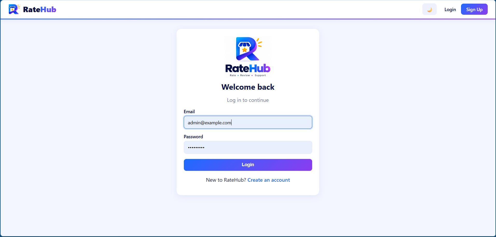

### Signup

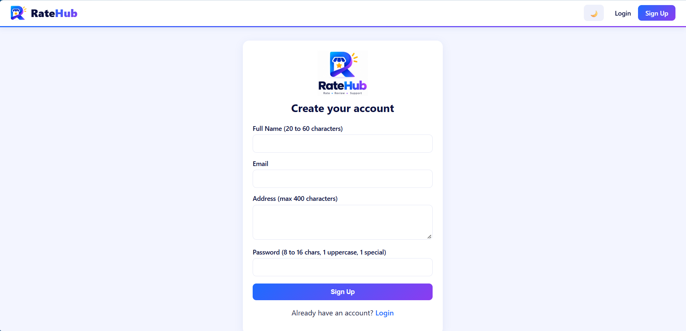

### Admin Dashboard

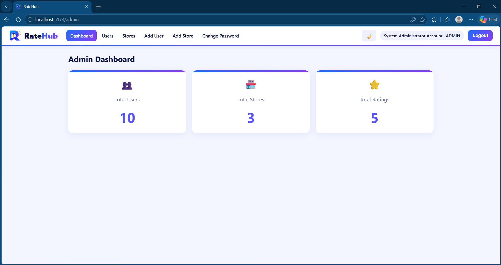

### Admin Users

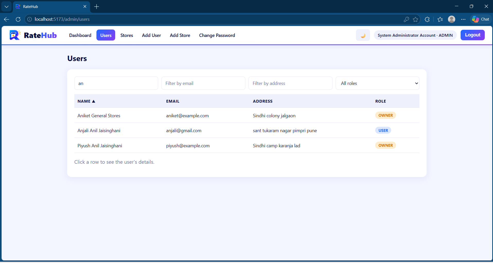

### Admin Stores

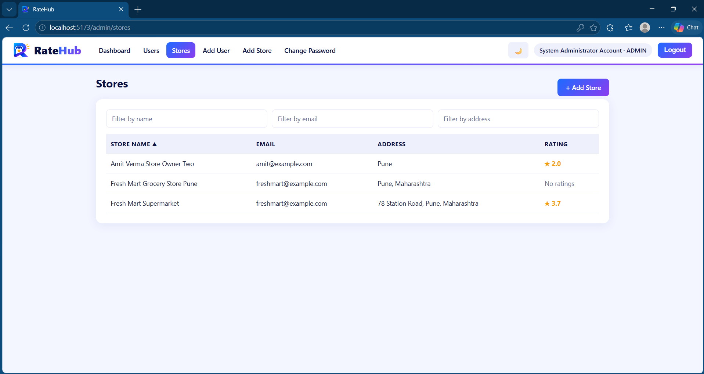

### Add User


### Add Store

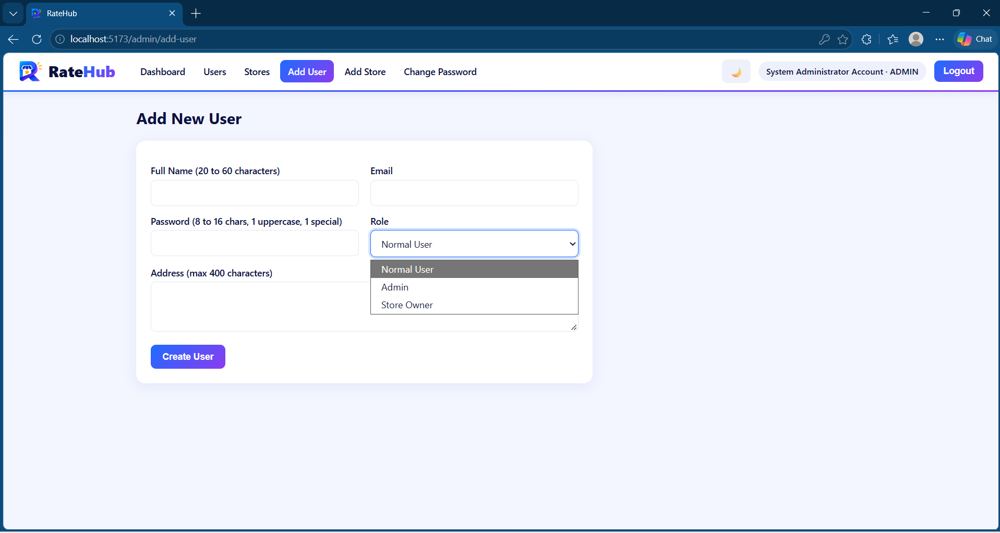

### User Stores & Rating

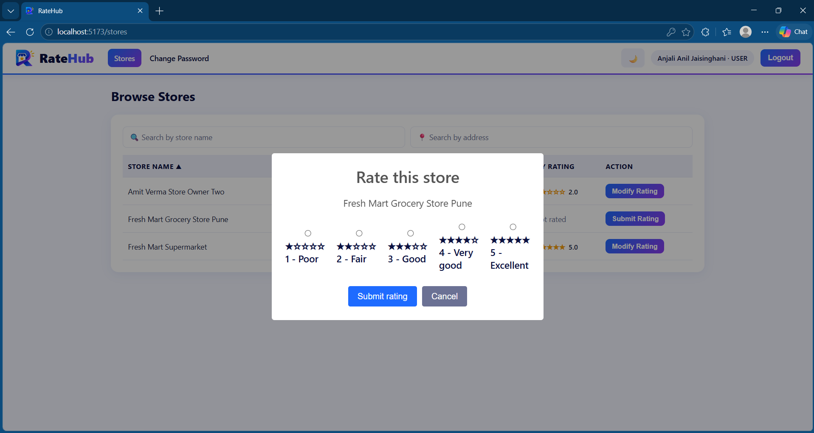

### Owner Dashboard

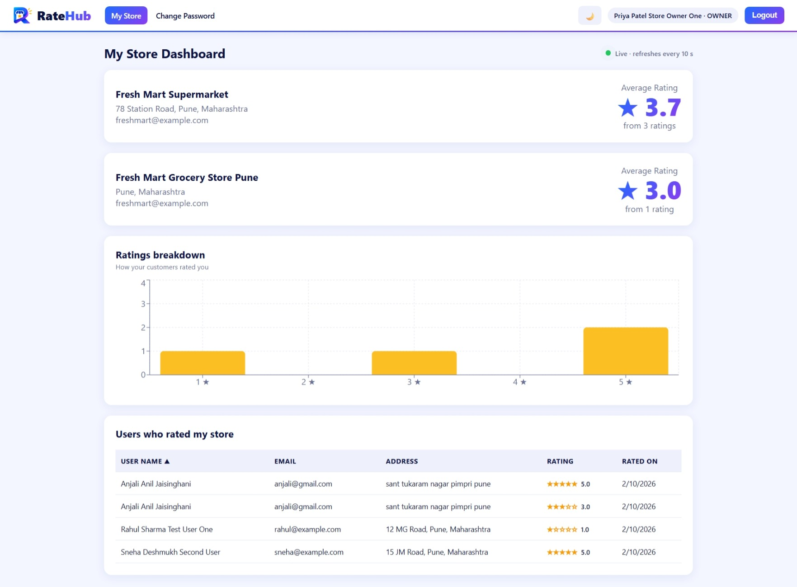

### Change Password

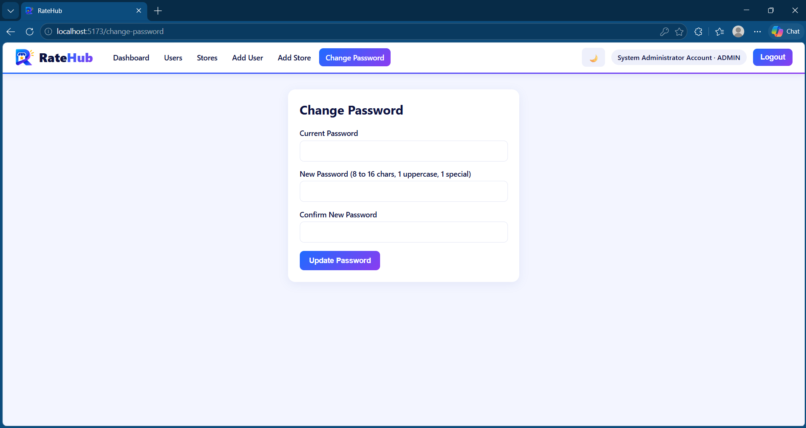

### Dark Mode

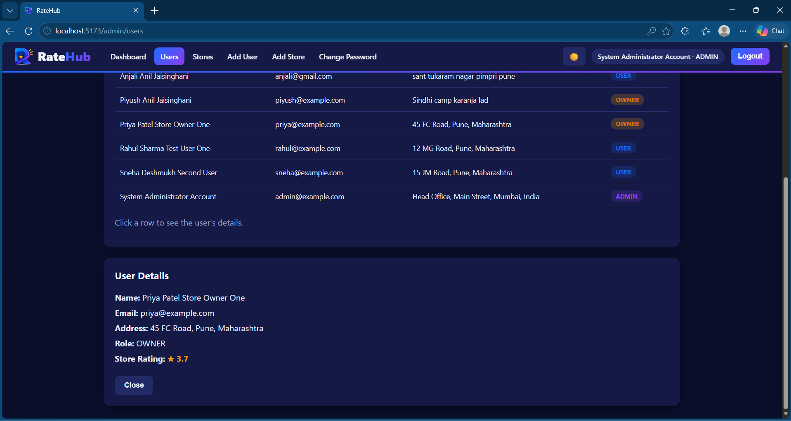

## Future Improvements

* Pagination
* Refresh tokens
* Email verification
* Store images
* Written reviews and comments
* Automated unit and integration tests
* Deployment with a cloud database and hosting
